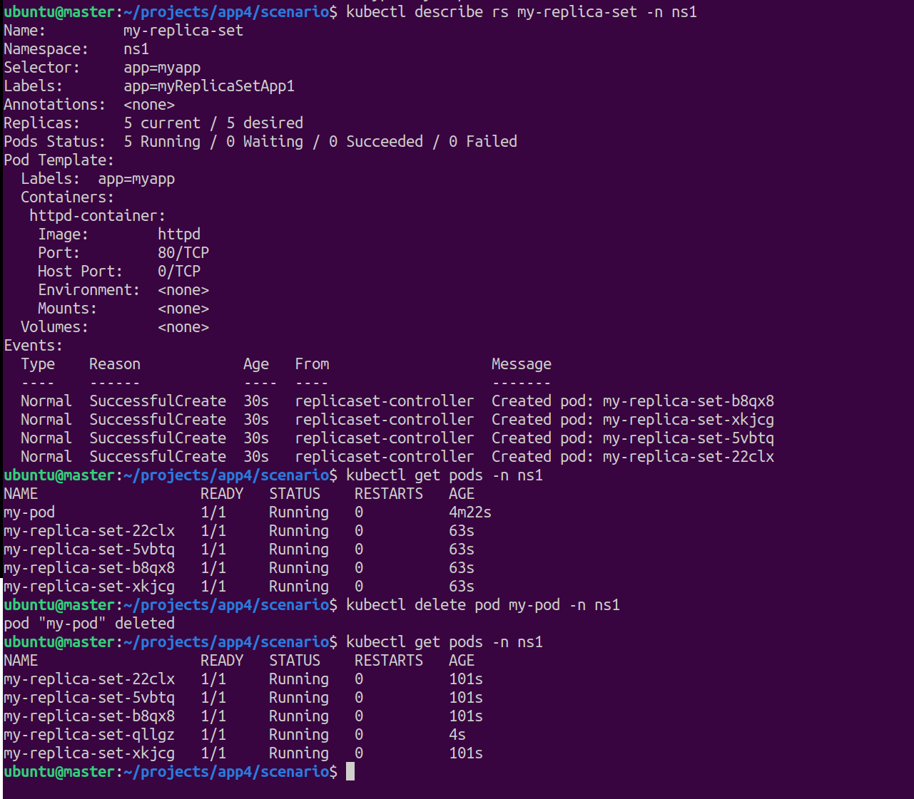

# ReplicaSet

This directory demonstrates how a **ReplicaSet** manages Pods in Kubernetes.

## Scenario Overview

The [scenario-1](./scenario-1/) directory contains:

- A simple [Pod manifest](./scenario-1/pod1.yaml) with the label `app: myapp`.
- A [ReplicaSet manifest](./scenario-1/rs1.yaml) configured as follows:

    ```yaml
    selector:
      matchLabels:
        app: myapp
    ```

### Key Points

- The ReplicaSet uses a selector to manage Pods with the label `app: myapp`.
- If any Pod matching this label is deleted, the ReplicaSet automatically creates a replacement to maintain the desired number of replicas.
- In this scenario, a Pod was manually created before applying the ReplicaSet.
- The ReplicaSet is configured with `replicas: 5`, but only 4 new Pods are created because one matching Pod already exists. This demonstrates that the ReplicaSet recognizes and manages existing Pods with the correct label.

## Screenshot



