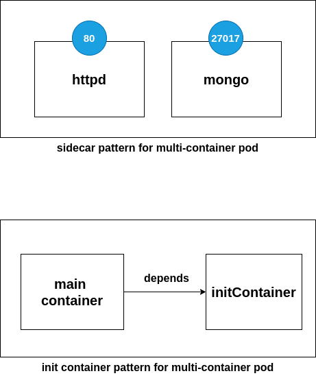
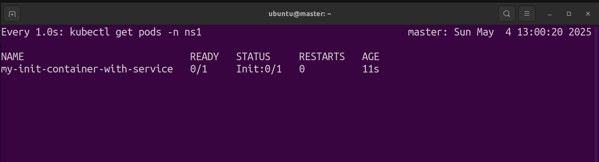
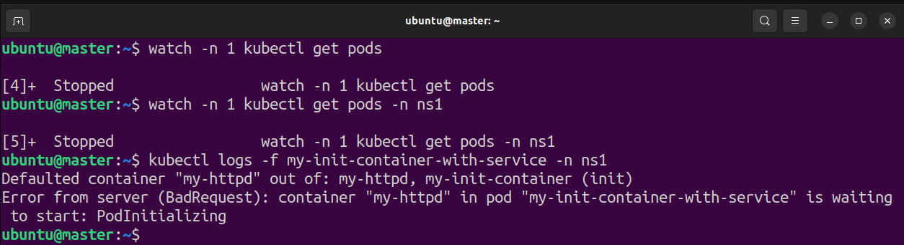
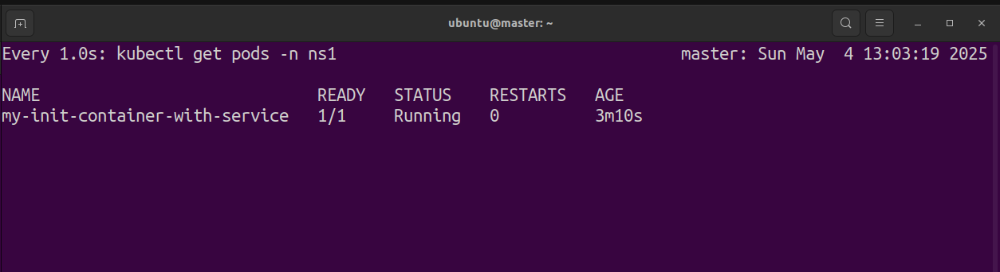

./app6

Contains kubernetes application of sidecar and init container type

```
1. side car container
2. init container
```




**Side car container :**

    Side car pattern means both the applications running simulteneously 

**Init container :**

    1. Init container are like dependent container. until and unless initi container doesn't terminate successfully main conatiner wont start
    2. There can be more than one init container inside a single pod.

Ref link : https://kubernetes.io/docs/concepts/workloads/pods/init-containers/


## init container failure scenario :

### Steps to generate error

1. Run a [init-container](./init-container-with-service-failure.yaml)
2. Execute command : `kubectl logs -f init-container-with-service-failure -n ns1`
3. check the error logs

It will look something like below:

```
waiting for myservice
Server:		10.96.0.10
Address:	10.96.0.10:53

** server can't find myservice.ns1.svc.cluster.local: NXDOMAIN
```


## init container success scenario :

### Steps to run

1. Run a [init-container](./init-container-with-service.yaml)
2. Execute command : `kubectl get pods -n ns1`

    will get below status :

    

3. check the error logs : `kubectl logs -f my-init-container-with-service -n ns1`

    will get below error :

    

4. Then run [init-service](./init-container-service.yaml)

    will get below changing state (success) msg:

    
   