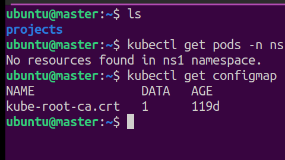
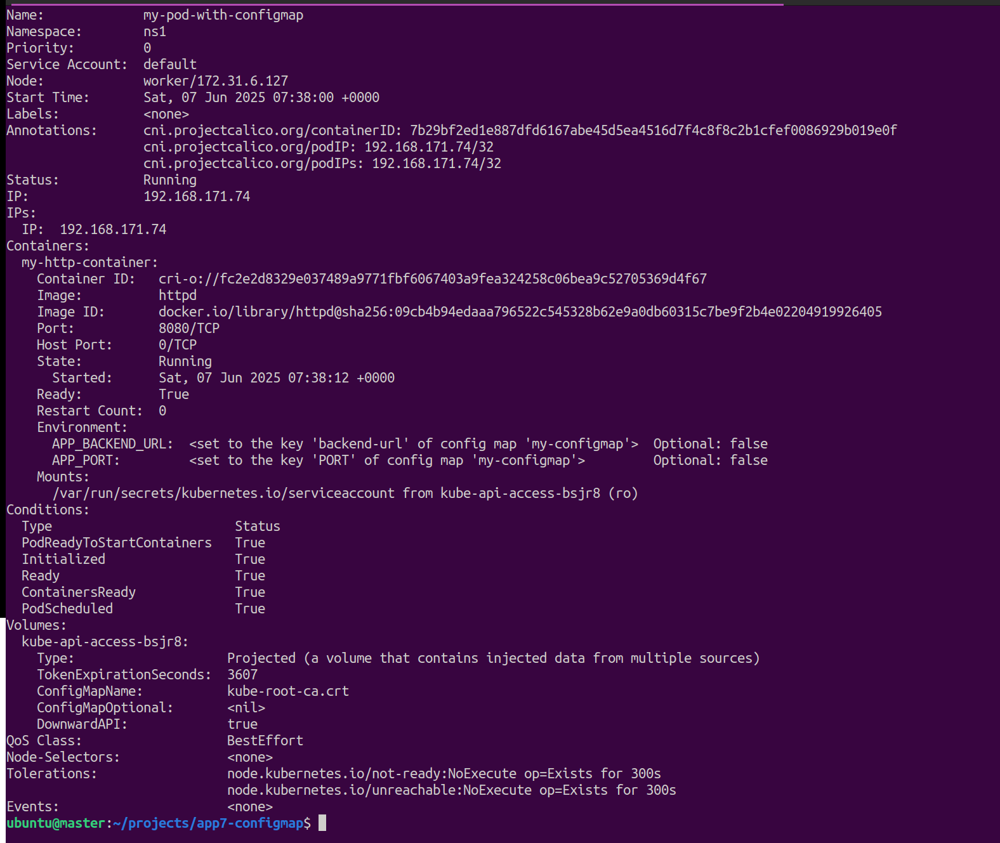

## Config Map

- Used for storing non-sensitive configurations
    - e.g. Port number, Backend URL
- Collections of key value pair (configurations)
- All the configurations stored in configmap are exposed to application via environment variable.
- All values must be in string format meaning wrapped in double quotes

Note : configmap can be used as `cm` in kubectl commands.

```bash
#get the list of ConfigMap
> kubectl get configmap
> kubectl get cm
```

#### Output will be like below :




## Create first config map and verify it.

### Steps :
1. Create a configmap and pod configured in file : [Document](./firstConfigMap.yaml)
2. Execute below command
    ```bash
    ubuntu@master:~/projects/app7-configmap$ kubectl apply -f ./configmap1.yaml 
    # configmap/my-configmap created
    # pod/my-pod-with-configmap created
    ```
3. Verify Newly created configmap :

    ```bash
    ubuntu@master:~/projects/app7-configmap$ kubectl describe cm my-configmap -n ns1
    #   Name:         my-configmap
    #   Namespace:    ns1
    #   Labels:       <none>
    #   Annotations:  <none>

    #   Data
    #   ====
    #   backend-url:
    #   ----
    #   http://my-backend-service:8080
    #   PORT:
    #   ----
    #   8080
   
    #   BinaryData
    #   ====

    #Events:  <none>
    ```
4. Same can be verified by exec into pod and execute `printenv` command

    ```bash
    #exec into pod
    >kubectl exec -it my-pod-with-configmap -n ns1 -- bash
    ```
    

### Command to delete configMap

    ```bash
    #delete configmap
    > kubectl delete configmap my-configmap -n ns1
    ```