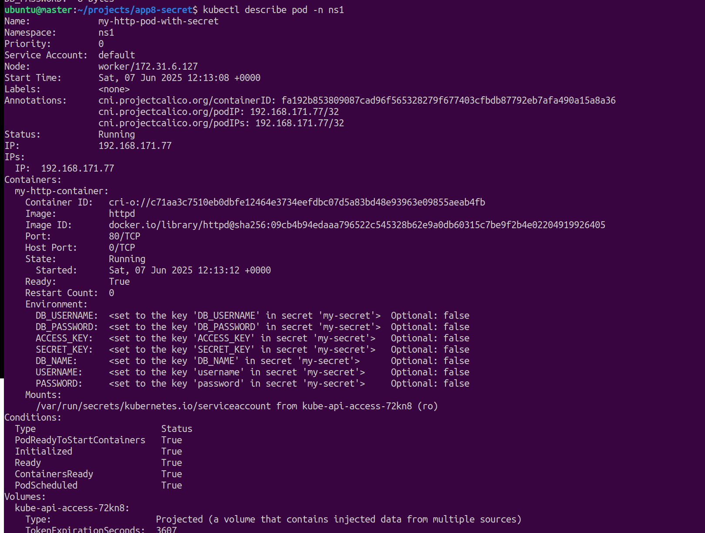
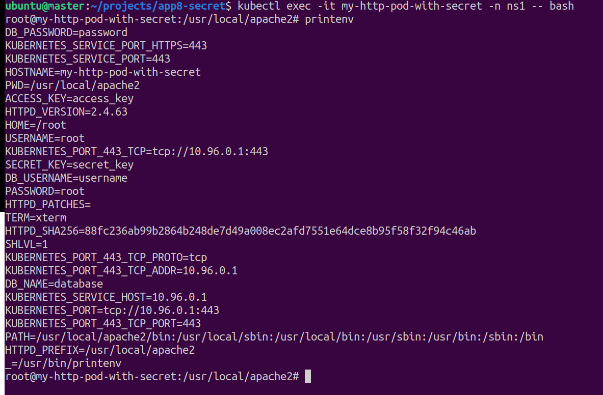

## Secrets

- Used for storing sensitive configurations
    - e.g. passwords, access tokens, secrets
- Collections of key value pair (configurations)
- All the configurations stored in secrets are exposed to application via environment variable.
- All values must be in `base64` encoded string format meaning wrapped in double quotes

```bash
#get the list of secrets

>kubectl get secrets

#delete secret
>kubectl delete secrets my-secret -n ns1
```

## Create a secret :

#### Steps :

1. Create secrets and pod with file : [Secrets](./secrets1.yaml)
2. Verify the configurations by executing below command :

    ```bash
    #create a secret
    > ubuntu@master:~/projects/app8-secret$ kubectl apply -f secret1.yaml 
        #secret/my-secret created
        #pod/my-http-pod-with-secret created

    #check details of secrets
    > ubuntu@master:~/projects/app8-secret$ kubectl describe secrets -n ns1
        #Name:         my-secret
        #Namespace:    ns1
        #Labels:       <none>
        #Annotations:  <none>
        
        #Type:  Opaque
        
        #Data
        #====
        #DB_USERNAME:  8 bytes
        #SECRET_KEY:   10 bytes
        #password:     4 bytes
        #username:     4 bytes
        #ACCESS_KEY:   10 bytes
        #DB_NAME:      8 bytes
        #DB_PASSWORD:  8 bytes

    ```
3.check details of pods
        

4.exec into pods for details 
        
    